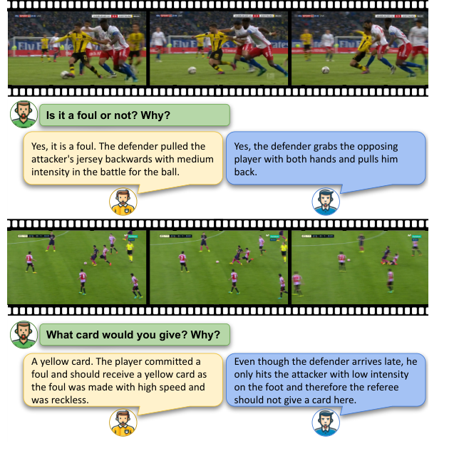
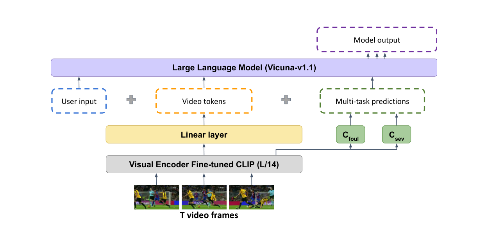
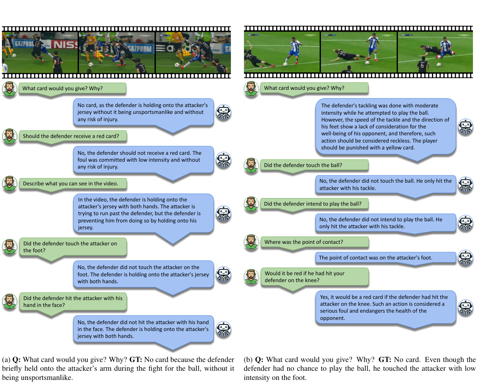

# [논문 리뷰] X-VARS: Introducing Explainability in Football Refereeing with Multi-Modal Large Language Models

> Jan Held, Hani Itani, Anthony Cioppa, Silvio Giancola, Bernard Ghanem, Marc Van Droogenbroeck
> University of Liège · KAUST
> 원문: [arXiv:2404.06332](https://arxiv.org/abs/2404.06332)

## 0. 들어가며

신경망은 성능이 올라갈수록 판단의 근거를 설명하기 어려워지는, 이른바 블랙박스 문제를 안고 있습니다. 이 논문은 그 문제를 정면으로 다룹니다. 무대는 축구 심판 판정입니다. 심판 판정은 규칙 지식과 맥락 이해(의도, 위치, 강도)가 모두 필요하고, 심판마다 해석이 갈리는 본질적으로 주관적인 태스크라서, "AI가 판정만 하는 게 아니라 왜 그렇게 판정했는지 설명할 수 있는가"를 실험하기에 이상적인 환경입니다.

결론부터 말하면, 이 논문은 **판정 결과만 내놓던 분류 모델을, 판정과 그 이유를 문장으로 생성하는 멀티모달 생성 모델로 전환**했습니다. 그리고 블라인드 평가에서 인간 심판(5점 만점에 4.0)에 근접한 3.8점의 설명 품질을 달성했습니다.

## 1. Introduction

### 1.1 문제의식: 성능과 설명가능성의 트레이드오프

모델 성능이 올라갈수록 내부 판단 과정은 수백만 개의 가중치에 분산되어 사람이 읽을 수 없게 됩니다. 의료, 자율주행, 스포츠처럼 신뢰가 전제되어야 하는 도메인에서는 이게 치명적입니다. 특히 축구에서 심판 판정은 클럽의 재정과 존폐에 직접 영향을 주기 때문에, AI가 판정에 개입하려면 "왜"를 투명하게 설명하는 능력이 수용의 전제 조건이 됩니다.

선례도 있습니다. 2022 카타르 월드컵의 반자동 오프사이드 판독은 3D 재현 영상으로 판정 근거를 "보여주는" 방식으로 신뢰를 얻었습니다. 이 논문은 같은 문제를 **언어로 설명하는** 방향으로 접근합니다.

### 1.2 왜 축구 심판인가

- 규칙(Laws of the Game) 지식 + 상황 맥락 + 미래 예측(어드밴티지 판단)까지 요구되는 복합 추론 태스크입니다.
- 판정이 본질적으로 주관적이라, 같은 장면에도 심판마다 다른 답이 나옵니다. "정답이 하나가 아닌" 상황에서의 설명 능력을 시험할 수 있습니다.

### 1.3 기여 요약

1. **SoccerNet-XFoul** — 심판 70여 명이 주석한 22k+ 비디오-질문-답변 데이터셋 공개
2. **X-VARS** — 비디오 캡셔닝, QA, 액션 인식, 대화가 가능한 비전-언어 모델. 설명 품질이 인간 수준
3. **철저한 평가** — 새 학습 패러다임 분석, CLIP 텍스트 예측의 영향 분석, 심판 대상 휴먼 스터디

## 2. Related Work

세 갈래의 선행 연구 위에 서 있습니다.

- **스포츠 비디오 이해**: 선수 추적, 액션 스포팅 등은 SoccerNet 시리즈가 표준입니다. 직계 전작은 같은 저자들의 **VARS**(CVPRW 2023)로, 멀티뷰 영상에서 파울을 분류만 했습니다. 판정은 하지만 설명은 못 하는 모델이었습니다.
- **비전-언어 모델(VLM)**: CLIP(2021)이 이미지·텍스트 공동 임베딩을, LLaVA(2023)가 "선형 레이어 하나로 CLIP 피처를 LLM에 연결해도 시각 대화가 된다"를, Video-ChatGPT(2023)가 이를 비디오로 확장했습니다. X-VARS는 Video-ChatGPT를 백본으로 씁니다.
- **설명가능성(XAI)**: LIME, SHAP, Grad-CAM, counterfactual 같은 기법은 피처 중요도나 히트맵 수준의 사후 설명입니다. "어디를 봤는지"는 알려주지만 "왜 그래서 파울인지"는 말하지 못합니다. 이 논문은 자연어 대화형 설명(Explanation via Language) 노선입니다.

## 3. SoccerNet-XFoul Dataset

블랙박스의 근본 원인 중 하나는 데이터 형태입니다. `[영상 → 파울(1)]`로 학습하면 모델은 결과만 맞추도록 최적화되고, 설명 능력은 학습 신호 어디에도 없습니다. 그래서 이 논문은 라벨 자체를 바꿉니다. `[영상 → "수비수가 낮은 강도로 발을 건드렸으므로 카드 없음"]` — **인간 심판의 추론 과정을 문장으로 라벨링**한 것입니다.

### 3.1 질문 설계

심판이 경기 중 마주하는 가장 근본적인 판단 4가지를 질문으로 삼았습니다.

| # | 질문 | 요구 능력 |
|---|---|---|
| 1 | 파울인가? 왜? | 규칙 + 맥락(의도·위치·강도) |
| 2 | 무슨 카드? 왜? | 심각도 판단(속도, 부상 위험) |
| 3 | 유망한 공격을 끊었나? | 미래 예측 — 파울이 없었다면? |
| 4 | 어드밴티지를 줄 수 있었나? | 미래 예측 — 프리킥보다 진행이 유리한가? |

3·4번은 **일어나지 않은 미래**를 추론해야 하는 질문으로, 기존 VQA 데이터셋과 차원이 다른 난이도입니다.

### 3.2 주석 과정

- 현직 심판 **70+명**이 3개월간 참여했습니다. 경력은 140~2,279경기(평균 655경기)로, 전문성이 검증된 인원만 선발했습니다.
- 피로 방지를 위해 원하는 만큼만, 언제든 중단 가능하게 했습니다.
- 언어 장벽을 없애기 위해 독일어·프랑스어·영어·스페인어 답변을 허용하고, ChatGPT-3.5로 영어 번역 후 **다른 심판이 번역을 검수**했습니다.

결과: **10k 비디오 클립, 22k+ 질문-답변 쌍, 총 540k+ 단어(답변당 평균 25단어)**. 스포츠 도메인에서 가장 큰 VQA 데이터셋이고, 판정 이유 설명을 다루는 유일한 데이터셋입니다.

### 3.3 주관성을 버리지 않은 설계



이 데이터셋 설계에서 가장 눈여겨볼 부분입니다. 같은 장면에 한 심판은 "고속의 무모한 태클이니 옐로카드", 다른 심판은 "낮은 강도로 발에 닿았을 뿐이니 카드 없음"이라고 답합니다. 보통의 데이터셋이라면 다수결로 정답 하나를 강제하겠지만, XFoul은 같은 액션을 여러 심판에게 랜덤 배정해 **질문당 평균 1.5개의 답변을 모두 유지**합니다.

덕분에 모델은 "타당한 해석의 범위"와 다양한 추론 전략을 함께 학습하게 되고, 애매한 상황에서 더 강건해집니다. 주관적 판단이 필요한 다른 도메인에도 이식할 만한 아이디어입니다.

## 4. Model: X-VARS

### 4.1 전체 구조



구조는 **눈(비전 인코더) → 통역사(프로젝션) → 뇌(LLM)** 세 단계로 읽으면 이해가 쉽습니다.

### 4.2 눈: 파인튜닝된 CLIP ViT-L/14

클립당 16프레임(파울 시점 전후 8+8프레임, 224p)을 CLIP에 통과시켜 프레임 피처 $f_i$와 히든 스테이트 $h_i$를 얻습니다. 히든 스테이트는 시간축으로 평균 풀링해 공간 피처 $t$, 공간축으로 풀링해 시간 피처 $s$를 만들고, 둘을 이어붙여 시공간 피처 $z = [t \| s]$를 만듭니다.

X-VARS만의 차별점은 여기에 **분류 헤드 2개**를 달았다는 점입니다. 프레임 피처를 별도로 풀링해 $C_{foul}$(파울 유형 8종: Tackling, Holding, Pushing, Elbowing, Dive 등)과 $C_{sev}$(No offence / Offence+No card / +Yellow / +Red)로 1차 판단을 내리게 합니다.

### 4.3 통역사: 선형 프로젝션 레이어

LLM은 텍스트 토큰의 임베딩 공간만 이해하므로, 비디오 피처 $z$를 선형 레이어 하나로 그 공간에 투영해 "시각적 단어" 시퀀스 $w$로 바꿉니다. LLaVA 계열이 검증했듯 선형 레이어 하나로 충분하고, 심지어 Video-ChatGPT가 10만 비디오-텍스트 쌍으로 학습해둔 프로젝션 가중치를 재사용해 학습 비용을 아낍니다.

### 4.4 뇌: Vicuna-v1.1과 프롬프트 설계

LLM 입력은 다음과 같이 구성됩니다(논문 식 6).

```
USER: <질문> <P_foul> <P_sev> <비디오 토큰 w>
Assistant: (판정 + 이유 생성)
```

핵심 아이디어가 이 프롬프트에 있습니다. 분류 헤드의 argmax 예측 $P_{foul}, P_{sev}$를 **텍스트로 변환해 프롬프트에 주입**하는 것입니다. LLM이 백지에서 영상만 보고 판단하는 게 아니라, 도메인 분류기의 1차 판단을 힌트로 받고 시작합니다. 실제 심판이 눈으로 보고, 부심의 의견을 듣고, 입으로 판정 이유를 설명하는 구조와 닮았습니다.

LLM은 Vicuna-v1.1이고 LLaVA 가중치로 초기화해 시각 대화 능력을 물려받습니다.

## 5. Training

2단계 학습입니다.

### 5.1 Stage 1: 축구 지식 주입

범용 CLIP은 축구를 모릅니다. 파울 심각도 판단에는 강도·속도 같은 시간적 단서가 필요한데 정지 이미지 학습으로는 잡히지 않고, 무엇보다 모든 입력이 축구 클립이다 보니 범용 CLIP이 뽑는 피처가 서로 너무 비슷해서 LLM이 클립 간 차이를 구분할 수 없습니다.

그래서 CLIP과 분류 헤드를 SoccerNet-MVFoul 데이터셋으로 파인튜닝합니다. 두 태스크의 크로스엔트로피 손실을 합산하는 멀티태스크 학습이고, V100 1장으로 14 epochs, 약 9시간이 걸립니다.

### 5.2 Stage 2: 정렬 및 엔드투엔드 학습

CLIP과 분류 헤드는 동결해 축구 지식을 보존하고, 프로젝션 레이어와 **LLM 레이어의 단 1%만 QLoRA**로 파인튜닝합니다(A100 40GB 2장, 3 epochs, 약 2시간).

디테일 하나: 학습 때는 CLIP 예측 대신 ground truth $G_{foul}, G_{sev}$를 주입합니다. CLIP 예측의 노이즈가 학습을 오염시키는 걸 막기 위해서입니다. 흥미롭게도 GT(MVFoul 라벨)와 심판 답변(XFoul)이 항상 일치하지는 않아서, 모델이 텍스트 힌트만 맹신하지 않고 비디오 토큰도 함께 보도록 자연스럽게 유도됩니다.

전체 학습 비용이 GPU 3장 × 반나절 수준이라는 점도 주목할 만합니다. 저비용 도메인 특화 레시피입니다.

## 6. Experiments and Results

### 6.1 분류 성능: 설명하면서 판정도 더 잘한다

| 모델 | 뷰 | 파울 유형 Acc | Offence/Severity Acc |
|---|---|:---:|:---:|
| VARS-MViT (전 SOTA) | multi | 0.45 | 0.43 |
| 파인튜닝 CLIP (Stage 1) | single | **0.51** | 0.52 |
| **X-VARS** | single | / | **0.62** |

멀티뷰 없이 싱글뷰만으로 전 SOTA 대비 offence/severity 정확도를 19%p 올렸습니다. 측정 방법이 재밌는데, X-VARS가 생성한 설명 문장에서 ChatGPT-3.5로 분류 레이블을 추출해 GT와 비교했습니다. 파울 유형은 설명에 명시되지 않는 경우가 많아 측정하지 못했습니다.

### 6.2 휴먼 스터디: 심판과의 블라인드 비교

심판 20명(평균 490경기 경력)이 각자 20개 클립에 대해, 설명의 출처(인간/AI)를 모른 채 5점 척도로 평가했습니다.

| | 평균 | 1점 | 2점 | 3점 | 4점 | 5점 |
|---|:---:|:---:|:---:|:---:|:---:|:---:|
| 인간 심판 | **4.0** | 3% | 10% | 8% | 46% | 33% |
| X-VARS | **3.8** | 3% | 17% | 4% | 46% | 30% |

46%의 클립에서 X-VARS의 설명이 인간 심판보다 높은 점수를 받았습니다. 낮은 점수(2점)가 몰린 클립은 팔꿈치 가격, 밀기처럼 데이터셋에서 희귀한 파울 유형이었습니다. 데이터 불균형의 흔적입니다.

### 6.3 Ablation: 핵심 설계가 실제로 먹혔나

**힌트를 그냥 받아쓰는 건 아닌가?** — X-VARS의 최종 답변과 입력된 CLIP 예측의 일치율은 76%입니다. 100%가 아니라는 것은 모델이 힌트를 복사하지 않고 비디오 토큰으로 재평가한다는 증거입니다. 24%의 경우 모델이 "분류기가 틀렸다"고 판단하고 뒤집습니다.

**텍스트 예측 주입이 없다면?** — 주입 없이 학습한 버전은 "No foul"을 한 건도 맞추지 못하고 balanced accuracy 29%에 그칩니다. 주입 버전이 6%p 높고, 특히 희귀 액션에서 GT에 가까운 설명을 생성합니다. 분류기 힌트가 데이터 불균형의 완충재 역할을 하는 셈입니다.

### 6.4 정성 결과: 대화가 된다



2개 질문으로만 파인튜닝했는데도 영상 묘사, 후속 질문, 반사실 질문("무릎을 쳤다면 레드였을까?")까지 일반화합니다. Video-ChatGPT에게 물려받은 대화 능력이 파인튜닝을 거치고도 보존된 덕분입니다. 특히 "레드카드를 줘야 하지 않냐"는 유도 질문에도 판정을 유지하는 모습을 보이는데, LLM 특유의 아첨(sycophancy)이 억제된 점이 인상적입니다.

## 7. 한계와 시사점

### 7.1 한계

- **환각**: 영상에 없는 동작을 언급하는 경우가 있습니다. 저자들도 인정한 미해결 문제입니다. 설명이 생성됐다고 그 설명이 항상 참인 것은 아닙니다.
- **평가 범위**: 4개 질문으로 데이터를 만들었지만 평가는 2개(파울 여부, 카드)에 집중되어, 미래 예측형 질문의 성능은 검증되지 않았습니다.
- **주관적 GT**: 정답 자체가 주관적인데 "정답 일치" 프레임으로 분류 성능을 평가합니다. 휴먼 스터디로 보완했지만 20명 표본은 작습니다.
- **구세대 백본**: Vicuna-v1.1(2023) 기준이라, 방법론의 기여와 백본 성능의 기여가 섞여 있습니다.

### 7.2 내 질문들

1. X-VARS의 설명은 **판단의 근거**일까, 판단 후에 만들어낸 **그럴듯한 사후 합리화**일까? 이 둘을 실험으로 구분할 수 있을까?
2. 질문당 1.5개의 복수 정답 학습 — 법령 해석, 심사, 의료 소견처럼 주관적 판단이 필요한 다른 도메인에 이식한다면?
3. 백본을 최신 MLLM으로 바꾸면 환각은 사라질까, 아니면 더 그럴듯한 환각이 될까?
4. "분류기 예측을 텍스트로 주입"은 지금 관점에서 보면 tool-use/구조화된 컨텍스트 주입의 원형인데, 어디까지 일반화될까?

## 마치며

이 논문의 돌파구를 한 문장씩으로 정리하면 이렇습니다.

1. **데이터** — 결과가 아니라 추론 과정을 라벨링해서, 이유를 학습 목표로 만들었다.
2. **아키텍처** — 눈(CLIP)→통역사(프로젝션)→뇌(LLM) 구조로 시각 판단을 언어 추론의 영역으로 가져왔다.
3. **학습** — 분류기 힌트 주입 + 2단계 QLoRA로, 저비용으로 근거 있는 설명을 유도했다.

블랙박스가 완전히 열린 것은 아닙니다. 환각이 남아 있고, 설명과 실제 판단 근거가 같다는 보장도 없습니다. 하지만 결과만 뱉던 모델을, 심판이 4점을 줄 만한 설명을 생성하고 그 설명을 **평가 가능한 대상**으로 만들었다는 점에서 의미 있는 전진입니다.
