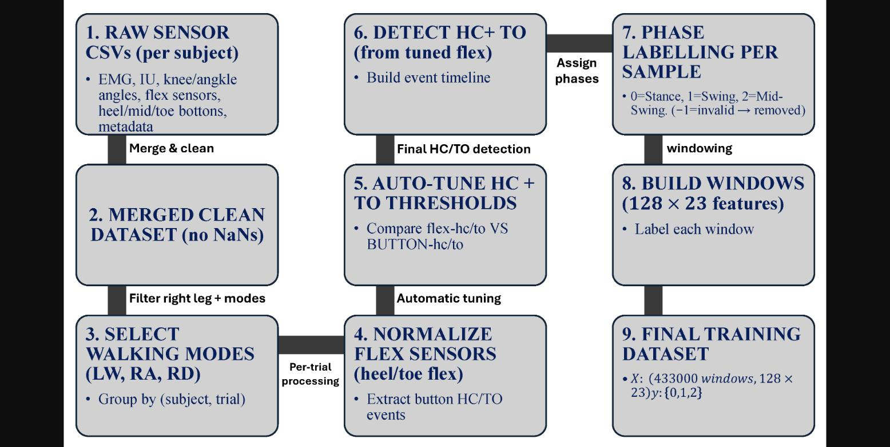

<!-- _class: lead -->
<!-- _paginate: false -->

# [논문 리뷰] Gait Phase Detection

### Machine Learning Models for Reliable Gait Phase Detection Using Lower-Limb Wearable Sensor Data

Muhammad Fiaz, Rosita Guido, Domenico Conforti
DeHealthLab, University of Calabria · Applied Sciences 2026

**발표: 김지민**

---

# 목차

1. **왜 이 논문인가** — 서베이에서 여기까지
2. **문제** — 이산 보행 위상 인식이 왜 어려운가
3. **데이터** — Zafar 공개 데이터셋과 23채널
4. **방법** — 자동 relabeling 파이프라인 + 고전 ML 5종
5. **실험** — Extra Trees 97.9%의 실체
6. **한계** — 저자가 인정한 것 + 내가 찾은 것
7. **직접 검증** — 논문 숫자를 재계산해봤다
8. **시사점** — WalkAI에서 뭘 갖다 쓸까

---

# 1. 왜 이 논문인가

- 지난 서베이(2026-08-18 발제)의 결론:
  - 보행 분석 응용의 한 축 = **이산 위상 인식 → 외골격·의족 제어**
  - 고질병 = **임상 보행 데이터 절대량 부족**
- 이 논문은 그 교차점의 실전 사례
  - 공개 착용형 다중센서 데이터로 stance / swing / mid-swing 3분류
  - DL 없이 **고전 ML 5종만** 통제 비교
- 그리고… 읽다 보니 **숫자가 이상해서** 직접 검증까지 하게 된 논문

> 오늘의 프레임: "Extra Trees가 최고"가 아니라 **"이 97.9%는 어떤 조건의 숫자인가"**

---

# 2.1 문제: 이산 보행 위상 인식

- 연속 센서 신호 → **stance / swing / (mid-swing)** 구간 분류
- 왜 중요한가
  - 의족·외골격은 위상에 맞춰 토크를 내야 함 → **위상 오검출 = 안전 문제**
  - 재활 모니터링에서 위상 타이밍 = 회복 지표
- 왜 어려운가
  - **라벨이 없다** — 대부분의 착용형 데이터셋은 원신호만 존재
  - 발 스위치는 기계적 바운스·지연 해제, 압력 센서는 드리프트
  - 규칙 기반(임계값)은 센서 위치·개인차에 취약

---

# 2.2 선행 연구 지형

| 연구 | 센서 | 최고 모델 | 성능 |
|------|------|-----------|------|
| Farah & Baddour | 허벅지 IMU 1개 | 결정트리 J48 | 97.5% |
| Pazar / Nazari | 섬유 스트레인 센서 | RF | 95.5% |
| Khamparia | 엉덩이·다리 가속도 | RF/트리 | 98.9% (FoG 이진) |
| Pasinetti | ToF 깊이 카메라 | 수정 RF | 87.3% |

- 문헌 전체가 **"트리 계열이 이긴다"** 로 수렴
- 이 논문의 차별점 주장: ① 자동 relabeling ② 다중 모달 통합 ③ 통일 파이프라인 벤치마크
- → 새로운 발견보다는 **확인(confirmation)에 가까움**

---

# 3.1 데이터: Zafar 공개 데이터셋

- figshare 공개, **6명** (건강 5: HP112~117 + 재활 1: UP112), 실내/실외
- 원 데이터셋은 앉기·서기·평지·경사·계단·속보 등 **9개 활동**, 전진/후진 트라이얼
- 논문은 **오른쪽 다리 23채널**만 사용, 100 Hz, 피험자별 z-score
  - sEMG 4 (ST, VL, SOL, TA)
  - IMU 2 (허벅지·정강이, 각 acc/gyro)
  - 관절각 인코더 2 (무릎·발목)
  - FlexiForce 압력 2 (뒤꿈치·발끝) + 발 스위치
- 본문은 "level-ground walking"이라는데 Fig 2에는 LW/RA/RD(평지+경사) 표기
  → **범위 서술부터 애매함** (복선 1)

---

# 3.2 핵심 기여 (라고 주장하는 것): 자동 relabeling

---

# 3.3 relabeling 파이프라인 상세

1. 발 스위치(heel/toe 버튼) 이진 전이로 **HS/TO 1차 추정**
2. 버튼 바운스 보정: heel/toe **flex 아날로그 신호**를 [0,1] 정규화
   - 임계값 0.10~0.90 그리드 탐색 (0.05 간격)
   - **버튼 이벤트와 시간차가 최소인 임계값을 trial별 자동 선택** (대개 0.2~0.4)
3. 위상 배정
   - stance = HS→TO
   - swing = TO→mid-swing
   - **mid-swing = swing 구간 중앙 20~25%** ← 임의 정의 (복선 2)
4. 결과: stance 186,468 / swing 125,033 / mid-swing 122,431 **샘플**

---

# 3.4 윈도잉과 특징

- 윈도우 길이 **L=128** (1.28초, 한 보행주기 커버)
- stride 64 → **50% overlap**
- 윈도우 라벨 = 지배 위상, **전이·혼합 윈도우는 제거**
- 특징: 128 × 23채널 = **2944차원 raw flatten**
  - 서론에는 "40개 통계 특징(mean/std/min/max/RMS)"이라 써놓음
  - 본문 방법은 flatten — **서론과 방법이 서로 다른 말** (복선 3)

---

# 3.5 모델 5종과 튜닝

| 모델 | 최종 설정 |
|------|-----------|
| Random Forest | n=200, depth=None, max_features=log2 |
| **Extra Trees** | n=100, depth=30, max_features=sqrt |
| XGBoost (GPU) | n=350, depth=8, **lr=0.2** |
| LightGBM (GPU) | n=250, depth=10, num_leaves=127, **lr=0.2** |
| kNN | StandardScaler, k=5, distance 가중, Manhattan |

- 트리 계열엔 역빈도 클래스 가중치, kNN만 스케일링
- 평가: 층화 80/20 + 층화 10-fold CV
- 지표: Acc / Prec / Rec / F1 + **MCC** (불균형 고려 주지표)

---

# 4.1 결과: 테스트셋

| 모델 | Acc | F1 | MCC | 학습(s) |
|------|-----|----|----|---------|
| Random Forest | 0.9773 | 0.9762 | 0.9652 | 1410.5 |
| **Extra Trees** | **0.9791** | **0.9781** | **0.9680** | 481.6 |
| XGBoost | 0.9132 | 0.9106 | 0.8670 | 435.2 |
| LightGBM | 0.8728 | 0.8688 | 0.8047 | 232.3 |
| kNN | 0.9323 | 0.9298 | 0.8961 | **12.8** |

- 10-fold CV도 동일 순위 (ET 0.9787 → RF → kNN → XGB → LGBM)
- 결론: **배깅 앙상블 > kNN > 부스팅**

---

# 4.2 정확도 vs 학습 시간

- kNN: 12.8초로 최속, 정확도 93% — 엣지 배포 관점에선 의외로 매력적
- RF와 ET의 시간 차이(1410 vs 482초)는 설정이 달라서 **알고리즘 비교로는 무효**

---

# 4.3 혼동행렬

---

# 4.4 혼동행렬, 본문과 그림이 다른 말을 한다

- 본문(§4.1): "모든 모델에서 최대 오류는 **swing ↔ mid-swing**"
- 그런데 Fig 5를 실제로 읽으면:
  - XGBoost: swing→**stance** 0.09, mid-swing→**stance** 0.08
  - LightGBM: swing→**stance** 0.11, mid-swing→**stance** 0.11
  - swing↔mid-swing 혼동은 0.03~0.06에 불과
- 부스팅이 진 진짜 이유 = **stance 경계 구분 실패**
  - 논의(§4.4)는 이를 놓치고 "고차원 노이즈에 부스팅이 민감"이라고만 설명
  - lr=0.2, num_leaves=127 → **튜닝 부족과 구분 불가**

---

# 5.1 저자가 인정한 한계 (§4.7 — 이 부분은 솔직함)

1. 50% overlap 윈도우를 **윈도우 단위로 섞어 분할**
   → 인접 윈도우가 train/test 양쪽에 → **낙관적 추정** (LOSO 안 함)
2. 6명, 실험실 환경 → 외적 타당도 낮음
3. 오른쪽 다리만 → 좌우 비대칭 분석 불가
4. **전이 윈도우 제거** → 실제 배포보다 쉬운 문제
5. 시계열/DL 모델과 비교 없음

> 저자 스스로 결론에서 97.9%를 **"upper performance bound"** 라고 표현

---

# 5.2 내가 추가로 찾은 문제들

| # | 문제 | 내용 |
|---|------|------|
| 1 | 범위 서술 | 본문 "평지 보행" vs Fig 2 "LW/RA/RD" |
| 2 | 특징 서술 | 서론 "40개 통계 특징" vs 방법 "2944차원 flatten" |
| 3 | 혼동행렬 해석 | 본문 주장과 Fig 5 수치 불일치 (앞 슬라이드) |
| 4 | 학습시간 비교 | RF/ET 설정이 달라 비교 무효 |
| 5 | **윈도우 수** | **Table 6 윈도우 수가 샘플 수와 동일 — ?** |

- 5번이 제일 이상해서… **직접 계산해봤습니다**

---

<!-- _class: lead -->

# 직접 검증

## "Table 6의 윈도우 434,000개는 나올 수 없는 숫자다"

---

# 6.1 검증 ①: 윈도우 수 산술 재계산

**논문이 스스로 준 숫자만으로 계산 가능:**

- 총 샘플: 186,468 + 125,033 + 122,431 = **433,932 샘플** (100 Hz ≈ 72분)
- 윈도우 규칙: L=128, stride 64 (50% overlap)
- 윈도우 수 ≈ (433,932 − 128) / 64 + 1 ≈ **6,780개** (트라이얼 경계 무시한 상한)

**그런데 Table 6 "Total Windows" = 186,468 / 125,033 / 122,431 — 샘플 수와 동일**

- Fig 2에도 "433,000 windows" 표기
- 샘플 수 = 윈도우 수가 되려면 **stride=1 (overlap 99.2%)** 이어야 함
  → 그러면 인접 윈도우 누수는 서술(50%)보다 **훨씬 심각**
- 어느 쪽이든: **본문의 윈도잉 서술과 결과 표가 서로 모순** (~64배 차이)

---

# 6.2 검증 ②: 원 데이터셋 설명서를 열어봤다

figshare 원본(Zafar et al., "Dataset for Lower Limb Prosthesis")의 공식 문서 확인:

- 데이터 열에 **보행 이벤트 인덱스(HS/TO) 열(AY–BF)이 이미 존재**
- 트리거 코드에 **Phase: 1=Stance, 2=Swing, 3=Mid-swing** — 3위상 체계가 **원 데이터셋에 이미 정의**
- 데이터셋 자체 Table 4: **flex vs footswitch의 IC/TO 검출 시간차 분석** 포함

**함의:**
- 논문의 전제 "원 데이터셋에 위상 라벨이 없어서 직접 생성" → 설명서와 **상충**
- mid-swing이라는 특이한 3분류, flex+버튼 융합 아이디어 모두 원 데이터셋 문서에 선례
- 핵심 기여(자동 relabeling)의 **신규성이 프레이밍 대비 줄어듦**

---

# 6.3 검증의 한계 (정직하게)

- 원본 Dataset.zip(2.0 GB)을 받아 **샘플 수 실측 재계산까지는 못 함**
  - 회선 속도 제약 (50분에 372 MB) — 발표 전 완료 불가
- 그래서 오늘 검증의 상태:
  - ✅ 윈도우 수 모순: **논문 내부 수치만으로 성립** (데이터 불필요)
  - ✅ 라벨 기존재: 데이터셋 **공식 설명서** 기준 (문서 증거)
  - ⏳ 열린 의문: 실데이터의 트리거 열 품질 — 라벨이 있지만 **불완전·희소했을 가능성**은 남음
    → 그렇다면 논문의 relabeling이 정당화될 수도 (실측 후 판단)

---

# 7.1 그래서 이 논문의 진짜 가치는

**숫자(97.9%)가 아니라 부품:**

- 버튼 + flex **적응 임계값 relabeling 절차** — 발 스위치 있는 데이터셋이면 이식 가능
  - 그리드 탐색 기준(버튼 이벤트와 시간차 최소화)이 단순하고 설명 가능
- **Zafar 데이터셋 자체** — sEMG+IMU+관절각+압력 동기화 공개셋 (6명이지만)
- MCC를 주지표로 쓰는 관행
- 그리고… **한계 목록을 저자가 직접 정리해준 것** (후속 연구 지도)

**교훈:**
- "Reliable"은 모델의 일반화가 아니라 **라벨 신뢰성**을 뜻했다
- 관대한 프로토콜(같은 피험자 + 인접 윈도우 + 전이 제거) 위에선 **아무 트리나 97%**

---

# 7.2 WalkAI 확장 실험 제안

1. 같은 파이프라인을 **LOSO(6-fold)** 로 재실행
   → 97.9%가 얼마나 떨어지는지가 이 논문의 진짜 후속 결과
2. **trial-wise split**만이라도 해서 누수 효과 분리
3. 전이 윈도우를 4번째 클래스로 두거나, **샘플 단위 sequence labeling** (Bi-LSTM / TCN / 1D-CNN)으로 전환
4. 채널 ablation: IMU 2개만 / sEMG 제외 — 실제 의족 제어에선 sEMG·인코더를 못 쓰는 경우 多
5. 부스팅의 stance 오류가 **HS/TO 경계 근처에 집중되는지** 경계 거리별 오류율 분석

+ (이번 검증의 후속) 원본 데이터 실측으로 **윈도우 수·라벨 품질 확정**

---

# 8. 정리

- 공개 6인 데이터셋, 23채널, 3위상 분류 — 고전 ML 5종 통제 비교, **Extra Trees 97.9%**
- 하지만 그 숫자는 **세 겹의 완화 조건** 위에 있다
  (같은 피험자 + 인접 윈도우 누수 + 전이 제거)
- 직접 재계산 결과, **윈도우 수는 논문 내부에서 모순** (샘플 수 = 윈도우 수, ~64배 차이)
- 원 데이터셋 설명서에는 **위상 라벨 체계가 이미 존재** — 핵심 기여의 신규성 의문
- 그래도 relabeling 절차와 한계 목록은 재사용 가치 있음

> **한줄평**: 논문을 읽는 것과 논문을 "검산"하는 것은 다른 작업이다 —
> 후자를 해보니 발표할 거리가 두 배가 됐다.

---

<!-- _class: lead -->

# Q&A

감사합니다

원문: doi.org/10.3390/app16031397
노트: github.com/sokcho-kim/sudo-read-paper

<!--
변환:
  npx @marp-team/marp-cli papers/2026-08-25-gait-phase-detection/slides.md -o papers/2026-08-25-gait-phase-detection/slides.pptx
-->
